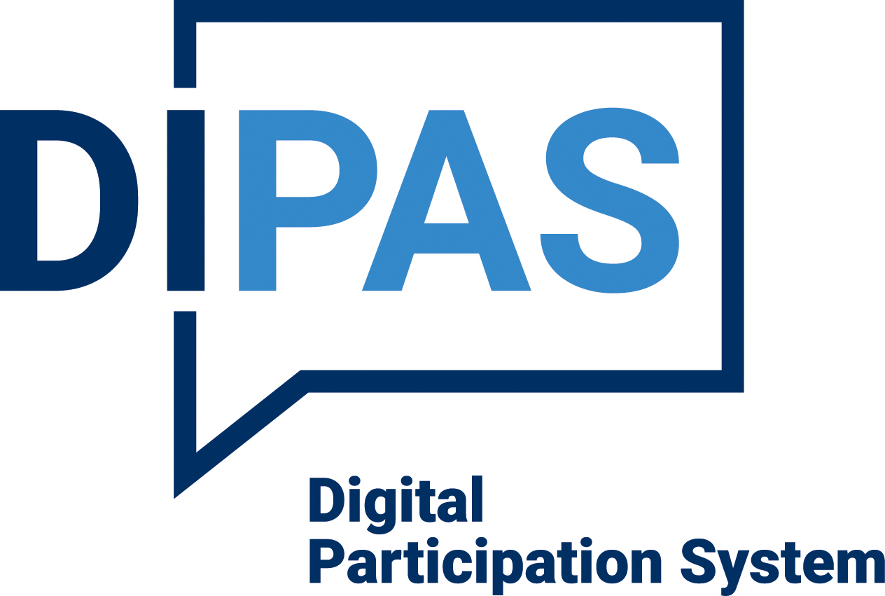

{width=250 height=250}

DIPAS (Digital Participation System)
=====

DIPAS (Digital Participation System) is a tool for digital citizen participation. With the help of DIPAS, online participations can be carried out supporting also an on-site instance for local citizen participation events via a multitouchtable.

# Getting started

These instructions will get you a copy of the project up and running. Read the files about [contributing](#contributing_to_dipas) to set up DIPAS on your local machine for development and testing purposes.

* [Project structure](structure.md)

# Initial set up of DIPAS

* [Download](https://bitbucket.org/geowerkstatt-hamburg/dipas/downloads/)
* [First steps to get DIPAS up and running](first_steps.md)

# Built with

* [Drupal](https://www.drupal.de) - The Content-Management-System used.
* [Vue.js](https://vuejs.org) - The web framework used.

# Contributing to DIPAS

* [First steps for developers](setup_dev_environment.md)
* See [Contribute.md](contribute.md) for details on our code of conduct, and the process for submitting pull requests to us.

# Versioning
We use [SemVer](http://semver.org/) for versioning. For the versions available see the [tags on our repository](https://bitbucket.org/geowerkstatt-hamburg/beteiligungsmodul2/commits).

# Author
**Freie und Hansestadt Hamburg** is a corporate entity under public law.

**Freie und Hansestadt Hamburg** is represented by:

```
Mayor Dr. Peter Tschentscher
Rathausmarkt 1
20095 Hamburg
Germany
```


## Contributors

Created under the leadership of the [Stadtwerkstatt](https://www.hamburg.de/stadtwerkstatt) and the technical support of [Geowerkstatt Hamburg](https://www.hamburg.de/geowerkstatt/).

# License

This project is licensed under the GNU GPLv2 or later license - see the [LICENSE](https://bitbucket.org/geowerkstatt-hamburg/dipas/src/dev/LICENSE.txt) file for details.
